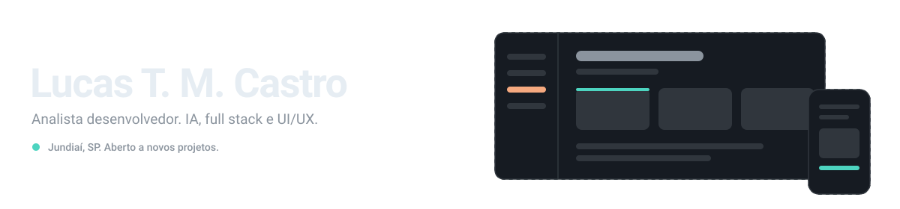
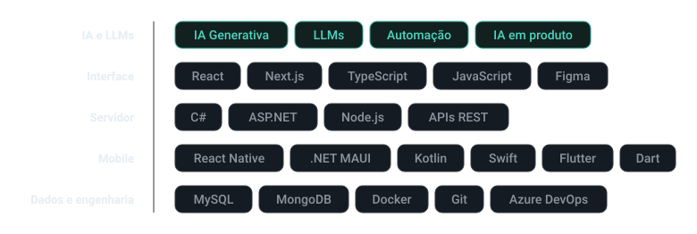

<!--
  README de perfil — Lucas T. M. Castro
  Paleta:  tinta #E6EDF3 / #1F2328 · texto #6E7A85 · linha #30363D
           acento 1 (menta) #2FA898 · acento 2 (âmbar) #E07A4F · superfície #151B23
  Regra:   fundo transparente nos widgets (bg_color=00000000) para funcionarem
           nos temas claro e escuro do GitHub sem duplicar URLs.
-->

  

  
  &nbsp;
  

---

Trabalho na interseção entre inteligência artificial, desenvolvimento de
software e estratégia de negócio. Construo soluções digitais de ponta a ponta:
entendo o problema, estruturo a ideia, desenho a interface e levo até a
arquitetura, a integração e a evolução do produto.

Full stack com IA generativa e LLMs aplicados a produtos, automações e
integrações. Do lado do design, atuo com UI, UX, prototipação, arquitetura da
informação e design systems — equilibrando estética, usabilidade e viabilidade
técnica.

Também mantenho projetos próprios voltados a SaaS, IA aplicada a produto e novas
experiências digitais. Inglês avançado.

## Stack

  

## Em destaque

<!-- Cards do github-readme-stats só funcionam com repositórios públicos.
     Como os seus são privados, aqui vai texto: mesmo peso informativo,
     nenhuma dependência externa, nada que possa quebrar.
     Ajuste as descrições — elas devem dizer o problema, não a tecnologia. -->

**Orbit.Finance** · Descreva em uma linha o problema que ele resolve e para quem.
`TypeScript` `React`

**Ordine** · Site desenvolvido como freelance. Diga o resultado, não o escopo.
`React` `Vite` `TypeScript`

**Orbit** · Aplicativo nativo. Uma linha sobre o que ele faz.
`Swift`

**LTMC** · Portfólio pessoal. Link para o site no lugar do repositório.
`TypeScript`

## Contribuições

<!-- Gerado por .github/workflows/snake.yml, uma vez por dia. -->

<picture>
  <source media="(prefers-color-scheme: dark)"
          srcset="https://raw.githubusercontent.com/luctmc/luctmc/output/snake-dark.svg">
  <source media="(prefers-color-scheme: light)"
          srcset="https://raw.githubusercontent.com/luctmc/luctmc/output/snake.svg">
  
</picture>
